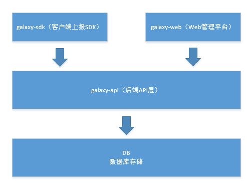

# galaxy

Galaxy is the analytics system for user behavior

# Children projects

* [galaxy-api](packages/galaxy-api) The backend api fro galaxy.

* [galaxy-management](packages/galaxy-management) The management paltform to configuration and show reports.

* [galaxy-sdk](packages/galaxy-sdk) The client data collector.
